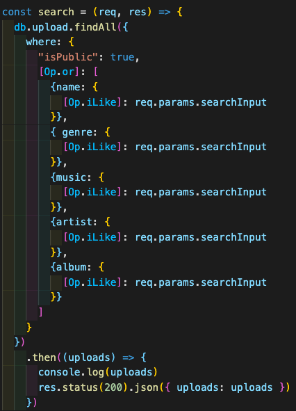
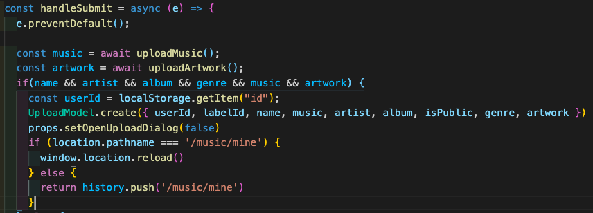

# greyscale

## introduction

featuring a minimal, easy-to-use interface, greyscale offers artists and bands a platform for sharing their music without getting carried away with the details.

## technologies used

* React.js
* Material-UI
* Postgres
* Express
* Node.js

## dependencies

* react
* react-router-dom
* material ui-icons
* material ui-core
* material ui-styles

## planning documents

refer to my Trello for these:
[Trello](https://trello.com/b/jx3e5gHV/greyscale)

## unsolved problems

* progress bar timing (issues with Math.ciel() in React)
* progress bar functionality (issues with Math.ciel() in React)
* play functionality has some limitations.

## future enhancements

* fully functional progress bar
* tags that can be attached to uploads
* more varied responsiveness
* better error handling
* scroll-based events

## code snippets

## personal links

[LinkedIn](https://www.linkedin.com/in/devin-blair/) 

[GitHub](https://github.com/dcblair)

## thanks

i am extremely grateful for Brock, James, Michael, Jacob, Uyen, David, Mario, and all of my SEIR 921 classmates. i appreciate all of your time, patience, and support.

to the reader, thank you for taking the time to check out this repo. :)

## references

[Context with Hooks](https://codesandbox.io/s/context-with-hooks-forked-gbci6?file=/src/context/UsersContext.js)

[Convert seconds to minutes and seconds using JavaScript](https://code.labstack.com/HVdZZYqH)

[audio example CodeSandbox](https://codesandbox.io/s/vigorous-rosalind-89qf6)